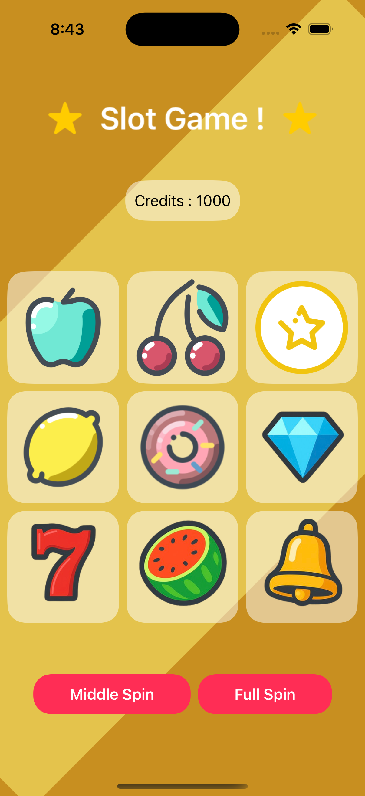

# 🎰 SlotGame

A fun and simple slot machine game built using **SwiftUI**. This project demonstrates the use of animations, image assets, and basic game logic within the SwiftUI framework for iOS.

## 📱 Features

- 🎮 Classic slot machine gameplay
- 🖼️ Custom slot symbols (apple, lemon, bell, diamond)
- 🔁 Randomized spin functionality
- 🎉 Winning logic and UI feedback
- 🔍 Includes UI tests for launch behavior

## 🛠️ Technologies Used

- **Swift**
- **SwiftUI**
- **Xcode**
- **MVU (Model-View-Update)** pattern style logic (if applicable)
- **XCTest** for UI testing

## 📷 Screenshots

| Home Screen |
|-------------|
|  |


## 🚀 Getting Started

### Prerequisites

- Xcode 14 or later
- iOS 15.0+
- macOS Monterey or later

### Installation

1. Clone the repository:

```bash
git clone https://github.com/yourusername/SlotGame.git
cd SlotGame

